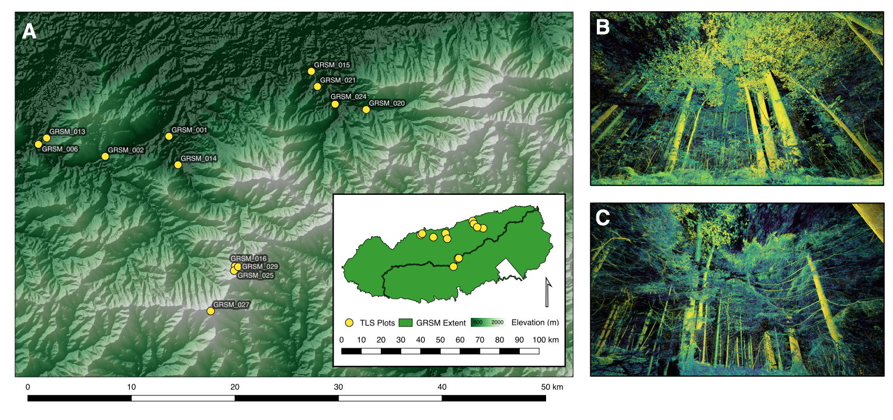

```{r setup, include=FALSE}
knitr::opts_chunk$set(echo = TRUE)
library(tidyverse)
library(ggplot2)
library(viridis)
library(kableExtra)
```

## R Markdown

Documentation for "Vegetation Structural Complexity and Biodiversity Across Elevation Gradients
  in the Great Smoky Mountains" submitted to Journal of Vegetation of Science, April 2020. 
  

```{r data-import}
# imports main data file
all.data <- read.csv("./data/grsm_atkins_walter_stovall.csv")
plant <- read.csv("./data/plant_diversity.csv")

# neon related data
neon <- read.csv("./data/grsm_sorted_plot_info.csv")

# sort the neon down
neon %>%
  dplyr::select(plotID, elevation) %>%
  data.frame() -> neon.elev

#@
df <- merge(all.data[,1:9], neon.elev, by = "plotID")

df <- merge(df, plant, by = "plotID")
```

## Variable Metadata

README file accompanying 'allplotdata.csv' here titled "./data/grsm_atkins_walter_stovall.csv"

This file defines column headings from 'allplotdata.csv', a spreadsheet summarizing data on forest structure and biodiversity across NEON plots in Great Smoky Mountains National Park. The data were produced by Jeff Atkins, Atticus Stovall, and Jonathan Walter with support of a grant from the Appalachian Highlands Science Learning Center Research Program in 2018. 'NA' indicates that relevant sampling activities for a particular variable did not occur at the plot.

Contacts: Jeff Atkins jwatkins6@vcu.edu; Atticus Stovall aes2aj@virginia.edu; Jonathan Walter jaw3es@virginia.edu

Column headings:

- plotID: the unique plot identifier code used by NEON

- avg.dxw: plot-level average (of 4 scans) vegetation area index (VAI)

- avg.p90: plot-level average (of 4 scans) canopy height

- avg.d: plot-level average (of 4 scans) canopy openness

- avg.dsd: plot-level average (of 4 scans) variability in openness

- sd.dxw: standard deviation (of 4 scans) VAI

- sd.p90: standard deviation (of 4 scans) canopy height

- sd.d: standard deviation (of 4 scans) canopy openness

- sd.dsd: standard deviation (of 4 scans) variability in openness

- richness: species richness of plant taxa

- shannon: Shannon's diversity index for plant taxa

- simpson: Simpson's diversity index for plant taxa


```{r table-sorted}
#create table of data sorted and named as in paper

# first we remove the data w/o strucutral data
x <- df[!is.na(df$avg.dxw),]

# rename data
names(x)[names(x) == "avg.dxw"] <- "VAI"
names(x)[names(x) == "avg.p90"] <- "p90 (m)"
names(x)[names(x) == "avg.d"] <- "Depth"
names(x)[names(x) == "avg.dsd"] <- "sd(Depth)"
names(x)[names(x) == "richness"] <- "Richness (Plant)"
names(x)[names(x) == "shannon"] <- "Shannon's Diversity (Plant)"
names(x)[names(x) == "plnt.simpson"] <- "Simpson's Diversity (Plant)"
names(x)[names(x) == "elevation"] <- "Elevation"

y <- x[, c(1:5,10:13)]

y[,2:5] <- format(round(y[,2:5], 2), nsmall = 2) 
y[,7:9] <- format(round(y[,7], 2), nsmall = 2) 

# remove duplicates
y <- distinct(y)
options(knitr.kable.NA = "")
y %>%
  kable() %>%
  kable_styling()
```
